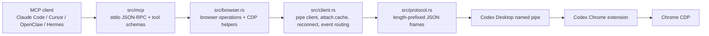

# Project Overview

## Preliminary Direction

Continue hardening `codex-browser-bridge` as a public Rust MCP server: improve stability, resource use, security boundaries, multi-client agent UX, real/mock E2E coverage, CI/CD, GitHub Release, npm publish automation, tag policy, and changelog discipline without adding defensive complexity that does not match the threat model.

## Current Architecture

The crate is a single-process Windows-first MCP server. It exposes 52 tools over stdio, then talks to Codex Desktop through a Windows named pipe using a length-prefixed JSON protocol. The library keeps non-Windows stubs so pure protocol/reconnect tests can run on Linux.

## Technology Stack

| Layer | Current | Target |
|:--|:--|:--|
| Language | Rust 2021, MSRV 1.85 | Keep MSRV explicit; only raise intentionally |
| Async runtime | Tokio | Keep |
| CLI | clap | Keep |
| MCP transport | stdio JSON-RPC | Keep; add bounded input and better harness tests |
| Browser transport | Windows named pipe to Codex Desktop | Keep; v2 cross-platform later |
| Package | npm wrapper downloads release binary | Keep; harden package contents and provenance |
| CI/CD | GitHub Actions | Tighten release gates and package checks |

## Entry Points

- `src/main.rs`: CLI entry for `mcp`, `cli`, `discover`, and `doctor`.
- `src/mcp/mod.rs`: MCP JSON-RPC dispatch and stdio loop.
- `src/mcp/schema.rs`: MCP tool registration and schemas.
- `src/browser.rs`: browser tool implementation layer.
- `src/client.rs`: pipe request/response, reconnect, attach cache, event subscriptions.
- `npm/bin/codex-browser-bridge.js`: npm command wrapper.
- `npm/scripts/install.js`: postinstall binary downloader.

## Build & Run

- `cargo check --locked`
- `cargo test --locked`
- `cargo clippy --locked --all-targets -- -D warnings`
- `cargo build --locked --release --target x86_64-pc-windows-msvc`
- `cd npm && npm test`
- Runtime: `codex-browser-bridge --mode mcp`

## Testing Baseline

Current `main` passes local Rust tests and clippy on Windows. Coverage is strongest for pure parsing, schema invariants, reconnect mocks on non-Windows, and npm checksum helpers. Gaps remain in handler-level tool mapping, Windows named-pipe simulation, true Codex Desktop/Chrome E2E, npm install main path, and release package-content validation.

## Project Governance Baseline

- Shared instructions: `AGENTS.md` exists but stale in tool counts and some paths.
- Claude-specific instructions: no `CLAUDE.md` currently.
- Project skill: `skills/codex-browser/SKILL.md` exists and is intended for npm distribution.
- Durable memory: no repo-local memory surface is declared; do not create one without explicit user selection.
- Progress tracking: no active `docs/progress/MASTER.md` existed before this run.

## External Integrations

- Codex Desktop named pipe and Chrome extension backend.
- Chrome DevTools Protocol.
- GitHub Actions, GitHub Releases, Dependabot, Codecov.
- npm registry with provenance publishing.
