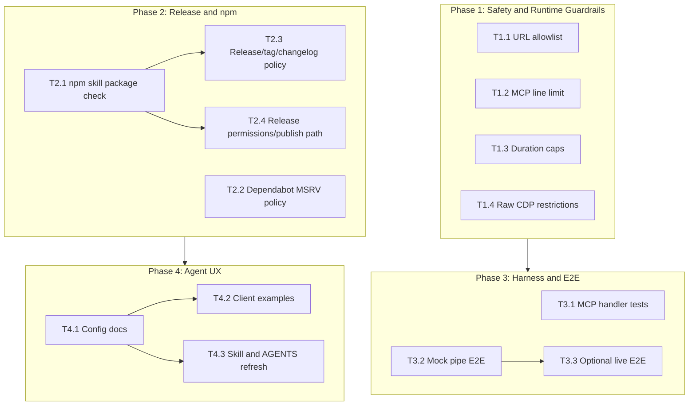

# Task Dependency Graph

```mermaid
graph TD
    subgraph P1["Phase 1: Safety and Runtime Guardrails"]
        T11["T1.1 URL allowlist"]
        T12["T1.2 MCP line limit"]
        T13["T1.3 Duration caps"]
        T14["T1.4 Raw CDP restrictions"]
    end

    subgraph P2["Phase 2: Release and npm"]
        T21["T2.1 npm skill package check"]
        T22["T2.2 Dependabot MSRV policy"]
        T23["T2.3 Release/tag/changelog policy"]
        T24["T2.4 Release permissions/publish path"]
        T21 --> T23
        T21 --> T24
    end

    subgraph P3["Phase 3: Harness and E2E"]
        T31["T3.1 MCP handler tests"]
        T32["T3.2 Mock pipe E2E"]
        T33["T3.3 Optional live E2E"]
        T32 --> T33
    end

    subgraph P4["Phase 4: Agent UX"]
        T41["T4.1 Config docs"]
        T42["T4.2 Client examples"]
        T43["T4.3 Skill and AGENTS refresh"]
        T41 --> T42
        T41 --> T43
    end

    P1 --> P3
    P2 --> P4
```
