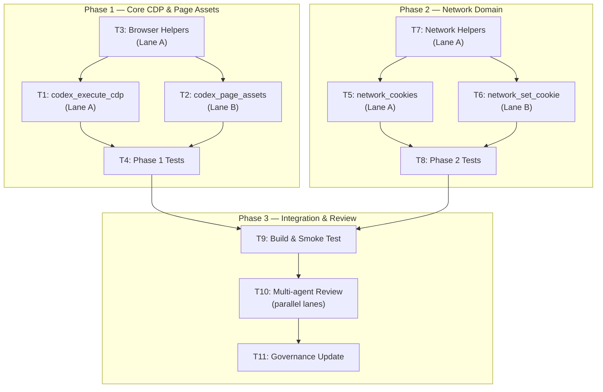

# Dependency Graph

## Parallel Lanes

### Phase 1
- **Lane A**: T3 → T1 (browser helpers, then CDP tool)
- **Lane B**: T2 (page assets, depends on T1 via T3)
- **Barrier**: After T1+T2+T3 complete → T4 (tests)

Actually, since this is a focused implementation in 2 files (`mcp.rs` + `browser.rs`), it's more efficient to implement serially:
1. All browser helpers (T3 + T7)
2. All MCP tools (T1 + T2 + T5 + T6)
3. All tests (T4 + T8)
4. Build + smoke (T9)
5. Review (T10)
6. Governance (T11)

No file-level merge conflicts because it's all additive.
